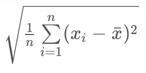
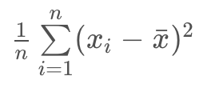
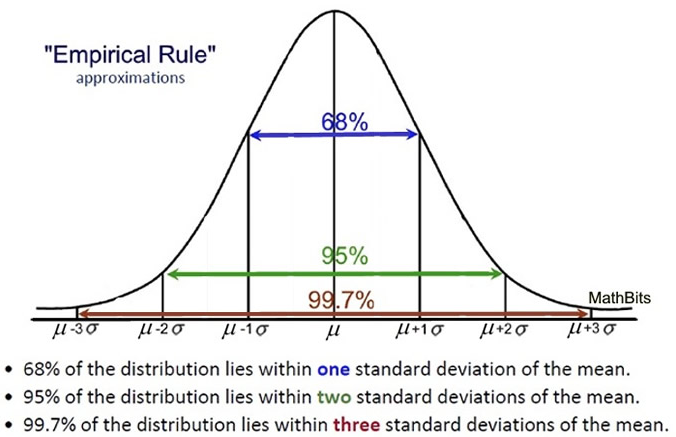
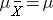
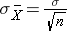

# Descriptive Statistics

**Four main aspects for quantitive data analysis**
1. Centre
2. Spread
3. Shape
4. Outlies

## Measures of Centre
**Three widely accepted measures of centres**
1. **Mean**

2. **Median** \
The median is a value that divides our data set such that 50% of the values are larger while the remaining 50% are smaller. \
 **_Calculation_**
 * Sort the values first
 * Odd number of observations \
 Median = the number in the direct middle
 * Even number of observations \
 Median = the average of the two values in the middle

 Whether the mean or median will be used to describe a dataset is largely dependent on the shape of our dataset and if there are any outliers.

3. **Mode** \
The mode is the most frequently observed value in our dataset. There might be multiple modes for a particular dataset, or no mode at all.
 * If all observations in our dataset are observed with the same frequency, there is no mode
 * If two (or more) numbers share the maximum value, then there is more than one mode.

## Measures of Spread

 **Calculating the 5 Number Summary**
 * **Minimum:** The smallest number in the dataset
 * **Q1:** The value such that 25% of the data fall below, which is the median of the data on the left side of Q2 (median)
 * **Q2:** The value such that 50% of the data fall below, which the median of the dataset
 * **Q3:** The value such that 75% of the data fall below, which is the median of the data on the right side of Q2 (median)
 * **Maximum:** The largest value in the dataset.

1. **Range** \
The **range** is calculated as the difference between the maximum and the minimum.

2. **Interquartile Range (IQR)** \
The **interquartile range** is calculated as the difference between **Q3** and **Q1**

3. **Standard Deviation** \
The standard deviation is the square root of the variance.\

4. **Variance**\
The variance is the average squared difference of each observation from the mean.\

## Measures of Shape

1. **Symmetric** \
mean=median=mode

2. **Right Skewed** \
median < mean

3. **Left Skewed** \
median > mean

## Working with Outliers
**Outliers Advice**
1. Plot your data to identify if you have outliers.
2. Handle outliers accordingly via the methods above.
3. If no outliers and your data follow a normal distribution - use the mean and standard deviation to describe your dataset, and report that the data are normally distributed. \
_**Side note**
If you aren't sure if your data are normally distributed, there are plots called [normal quantile plots](https://data.library.virginia.edu/understanding-q-q-plots/) and statistical methods like the [Kolmogorov-Smirnov test](https://en.wikipedia.org/wiki/Kolmogorov%E2%80%93Smirnov_test) that are aimed to help you understand whether or not your data are normally distributed. Implementing this test is beyond the scope of this class, but can be used as a fun fact._

4. If you have skewed data or outliers, use the five number summary to summarise your data and report the outliers.

we should work with outliers on a situation by situation basis. Common techniques include:

1. At least note they exist and the impact on summary statistics.

2. If typo - remove or fix

3. Understand why they exist, and the impact on questions we are trying to answer about our data.

4. Reporting the 5 number summary values is often a better indication than measures like the mean and standard deviation when we have outliers.

5. Be careful in reporting. Know how to ask the right questions.

## More On Centre And Spread
When analysing skewed data, it is common to report numeric summaries like the median and 5 number summary, as the mean and standard deviation may be misleading.

However, with symmetric data, the mean and standard deviation are commonly used, as we can understand what proportion of points might fall 1, 2, or 3 standard deviations away based on the empirical rule associated with normal distributions.

## Central Limit Theorem [1]
The **central limit theorem** states that if you have a population with mean μ and standard deviation σ and take sufficiently large random samples from the population with replacement, then the distribution of the sample means (sampling distribution) will be approximately normally distributed. This will hold true regardless of whether the source population is normal or skewed, provided the sample size is sufficiently large (usually n > 30). If the population is normal, then the theorem holds true even for samples smaller than 30. In fact, this also holds true even if the population is binomial, provided that min(np, n(1-p))> 5, where n is the sample size and p is the probability of success in the population. This means that we can use the normal probability model to quantify uncertainty when making inferences about a population mean based on the sample mean.

For the random samples we take from the population, we can compute the mean of the sample means:

and the standard deviation of the sample means:

[1] http://sphweb.bumc.bu.edu/otlt/MPH-Modules/BS/BS704_Probability/BS704_Probability12.html

## Descriptive vs. Inferential Statistics
**Descriptive Statistics** \
`Descriptive statistics` is about describing our collected data.

**Inferential Statistics** \
`Inferential Statistics` is about using our collected data to draw conclusions to a larger population.

We looked at specific examples that allowed us to identify the

1. Population - our entire group of interest.
2. Parameter - numeric summary about a population
3. Sample - subset of the population
4. Statistic numeric summary about a sample
